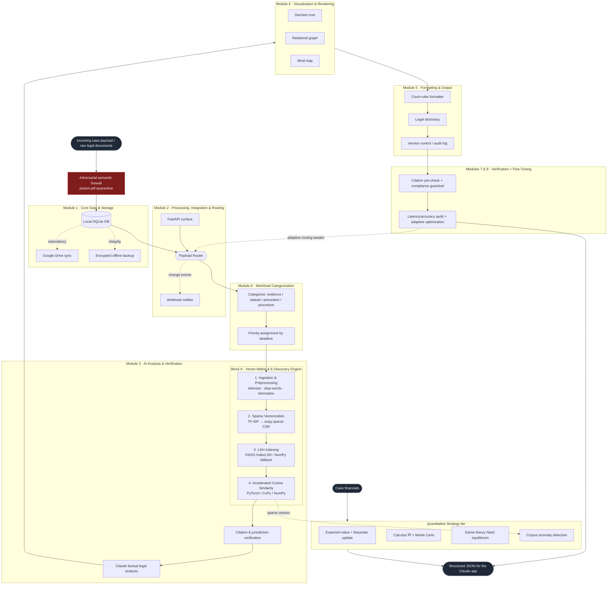

# Claude Legal — Unified Legal Analysis & Vector-Matrix Pipeline

One pipeline that merges two specs into a single system, orchestrated by Claude:

- **Block A — High-Performance Vector Matrix & E-Discovery Module**: ingest → sparse
  TF-IDF vectorization → FAISS LSH indexing → hardware-accelerated cosine similarity.
- **Block B — Claude Legal Superagent**: an 8-module legal-analysis architecture (storage,
  routing, AI analysis, visualization, formatting, workload, verification, fine-tuning).

**Block A is not a separate system — it is the semantic-search core of Block B's Module 3.**
Everything routes through one orchestrator (`claude_legal/pipeline.py`) so components stay modular
and plug into the broader Claude Legal workload without breaking existing routing logic.

---

## System architecture



The same diagram source lives in [`docs/architecture.mmd`](docs/architecture.mmd).

---

## Quickstart

```bash
cd claude-legal-pipeline
pip install -e .            # core deps only (numpy, scipy, scikit-learn, pydantic)

# Run the full pipeline offline on the bundled sample case:
python examples/run_pipeline.py

# Or via the CLI:
claude_legal process --case CASE-001 --corpus ./examples/sample_case \
    --text-file ./examples/sample_case/complaint.txt \
    --query "retaliation for reporting unsafe working conditions" \
    --plaintiff "Maria Santos" --defendant "Acme Logistics Inc." \
    --case-number "3:25-cv-01234"

pytest                     # 15 tests, run fully offline
```

### Optional accelerators & integrations

The core runs anywhere. Heavier backends and external edges activate when installed/configured:

```bash
pip install -e ".[accel]"  # faiss-cpu + torch  → FAISS LSH + GPU/SIMD cosine similarity
pip install -e ".[nlp]"    # spaCy / NLTK       → real lemmatization
pip install -e ".[legal]"  # eyecite            → robust citation extraction
pip install -e ".[llm]"    # anthropic          → Claude factual legal analysis
pip install -e ".[cloud]"  # Google Drive + cryptography → cloud sync + encrypted backups
pip install -e ".[api]"    # fastapi + uvicorn + httpx   → REST surface + webhooks
pip install -e ".[all]"    # everything
```

Copy `.env.example` → `.env` and fill in credentials to enable the gated edges. Without them,
those modules **no-op cleanly** (and log) instead of crashing — the full offline flow always runs.

---

## Module map

| Spec | Package location | What it does |
|------|------------------|--------------|
| **A#1** Ingestion & Preprocessing | `claude_legal/ingestion/` | tokenize, stop-word removal, lemmatization |
| **A#2** Sparse Vectorization | `claude_legal/vectorize/` | TF-IDF → **`scipy.sparse` CSR** (no dense path) |
| **A#3** LSH Indexing | `claude_legal/index/` | FAISS `IndexLSH` (+ NumPy random-hyperplane fallback) |
| **A#4** Accelerated Cosine Similarity | `claude_legal/query/` | PyTorch / CuPy / NumPy dot product on the LSH shortlist |
| **B1** Core Data & Storage | `claude_legal/storage/` | SQLite, Google Drive sync, Fernet-encrypted backups |
| **B2** Processing & Routing | `claude_legal/routing/` | payload router, webhooks, FastAPI |
| **B3** AI Analysis & Verification | `claude_legal/analysis/` | semantic search (Block A), citations, CourtListener citator, Claude analysis |
| **B4** Visualization | `claude_legal/visualization/` | decision tree, relational graph, mind map JSON |
| **B5** Formatting & Output | `claude_legal/formatting/` | court-rules formatter, legal dictionary, versioning |
| **B6** Workload Categorization | `claude_legal/workload/categorize.py`, `priority.py` | four-bucket parse + deadline priority |
| **B7** Verification & Error Handling | `claude_legal/workload/verify.py` | citation pre-check + compliance guardrail |
| **B8** Fine-Tuning & Perf Logging | `claude_legal/workload/metrics.py` | per-stage latency + adaptive suggestions |
| **Guard** Adversarial Semantic Firewall | `claude_legal/ingestion/security.py` | quarantines prompt-injection / "poison pill" documents at ingestion |
| **Quant** Quantitative Strategy tier | `claude_legal/quant/` | EV · Bayesian updating · calculus leverage (∇f) · Monte Carlo · game-theory Nash · corpus anomaly detection |

See [`ARCHITECTURE.md`](ARCHITECTURE.md) for the data-flow detail and JSON payload contracts,
and [`MASTER_PROMPT.md`](MASTER_PROMPT.md) for the single merged system prompt to drive an agent.

### Quantitative Strategy tier (`claude_legal/quant/`)

An optional decision-support layer that runs when `CaseFinancials` are supplied to
`process_case(...)`. It produces a `QuantitativeStrategyReport`:

- **Expected value** — `EV = P(win)·damages − P(loss)·cost`
- **Bayesian updating** — posterior win probability as new evidence arrives
- **Calculus leverage (∇f)** — partial derivatives of a non-linear damages model showing which
  input (evidence / witness / economic) moves the award most
- **Monte Carlo** — award distribution (p5/p50/p95) under variance; seeded for reproducibility
- **Game theory** — 2×2 settlement payoff tensor + pure-strategy Nash equilibrium
- **Anomaly detection** — cosine-similarity near-duplicate flags over the **real sparse Block A
  corpus** (adapted from the original simulated-embedding version to use actual TF-IDF vectors)

```bash
claude_legal process --case CASE-001 --corpus ./examples/sample_case \
    --text-file ./examples/sample_case/complaint.txt \
    --damages 1500000 --cost 200000 --evidence 0.8 --witness 0.6 --economic 1.2 --pwin 0.65
```

Ingestion is fronted by an **adversarial semantic firewall** (`claude_legal/ingestion/security.py`)
that quarantines documents containing prompt-injection ("poison pill") text before any of it
reaches the vectorizer or the LLM analyst.

### Citator (`claude_legal/analysis/citator.py`)

Offline citation extraction only proves a citation is *well-formed*. The citator closes that gap
with a real lookup against [CourtListener](https://www.courtlistener.com)'s public citation-lookup
API (Free Law Project) — it confirms a citation resolves to an actual, on-file opinion and
attaches the case name, cluster id, and CourtListener URL. It's a genuine network integration
(disabled by default, like the other credentialed edges) rather than a stub:

```bash
CLAUDE_LEGAL_COURTLISTENER_ENABLED=true claude_legal process --case CASE-001 \
    --text "See 347 U.S. 483 for the controlling standard." \
    --plaintiff "A" --defendant "B" --case-number "1:1"
```

**This is an existence check, not a good-law check.** CourtListener's free API does not do
automated negative-treatment / overruled detection (that's what paid citators like Westlaw KeyCite
or Lexis Shepard's provide) — a resolved, heavily-cited case can still have been overruled. See the
caveat block at the top of `citator.py` for the full disclosure, including that its response-field
mapping was written from CourtListener's documented API shape but could not be live-tested from the
sandboxed environment this was built in (outbound access to `courtlistener.com` is blocked by that
environment's network policy) — smoke-test it against the live API before depending on it.

---

## Design guarantees

- **Sparse-only vectors.** The corpus is a `scipy.sparse` CSR matrix end-to-end; `.toarray()`
  is never called on it (only tiny per-query shortlists are densified).
- **ANN, not O(N²).** Queries are compared only against LSH-bucket candidates; the result
  reports `candidates_scanned` vs `total_docs` so pruning is observable.
- **Strict modularity.** Modules talk only through the pydantic contracts in `claude_legal/schemas.py`;
  `pipeline.py` is the sole wiring point. New services register on the `PayloadRouter` without
  editing existing code.
- **Honest edges.** Cloud/LLM/webhook integrations are real library-backed code, gated by config.

> ⚠️ This is engineering scaffolding, not legal advice. "Verified" citations means *well-formed and
> jurisdiction-classified*; the optional CourtListener citator additionally confirms a citation
> resolves to a real opinion, but that is still not an authoritative good-law/negative-treatment
> check — wire a paid citator (KeyCite/Shepard's) before relying on good-law status, and have a
> licensed attorney review any generated filing.
