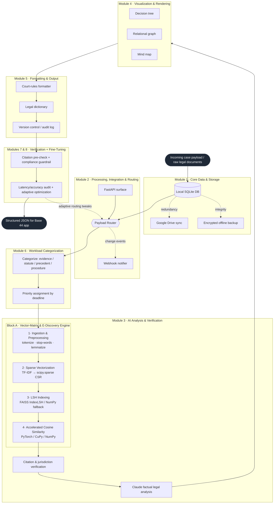

# base44 — Unified Legal Analysis & Vector-Matrix Pipeline

One pipeline that merges two specs into a single system:

- **Block A — High-Performance Vector Matrix & E-Discovery Module**: ingest → sparse
  TF-IDF vectorization → FAISS LSH indexing → hardware-accelerated cosine similarity.
- **Block B — Base 44 Superagent**: an 8-module legal-analysis architecture (storage,
  routing, AI analysis, visualization, formatting, workload, verification, fine-tuning).

**Block A is not a separate system — it is the semantic-search core of Block B's Module 3.**
Everything routes through one orchestrator (`base44/pipeline.py`) so components stay modular
and plug into the broader base44 workload without breaking existing routing logic.

---

## System architecture



The same diagram source lives in [`docs/architecture.mmd`](docs/architecture.mmd).

---

## Quickstart

```bash
cd base44-pipeline
pip install -e .            # core deps only (numpy, scipy, scikit-learn, pydantic)

# Run the full pipeline offline on the bundled sample case:
python examples/run_pipeline.py

# Or via the CLI:
base44 process --case CASE-001 --corpus ./examples/sample_case \
    --text-file ./examples/sample_case/complaint.txt \
    --query "retaliation for reporting unsafe working conditions" \
    --plaintiff "Maria Santos" --defendant "Acme Logistics Inc." \
    --case-number "3:25-cv-01234"

pytest                     # 15 tests, run fully offline
```

### Optional accelerators & integrations

The core runs anywhere. Heavier backends and external edges activate when installed/configured:

```bash
pip install -e ".[accel]"  # faiss-cpu + torch  → FAISS LSH + GPU/SIMD cosine similarity
pip install -e ".[nlp]"    # spaCy / NLTK       → real lemmatization
pip install -e ".[legal]"  # eyecite            → robust citation extraction
pip install -e ".[llm]"    # anthropic          → Claude factual legal analysis
pip install -e ".[cloud]"  # Google Drive + cryptography → cloud sync + encrypted backups
pip install -e ".[api]"    # fastapi + uvicorn + httpx   → REST surface + webhooks
pip install -e ".[all]"    # everything
```

Copy `.env.example` → `.env` and fill in credentials to enable the gated edges. Without them,
those modules **no-op cleanly** (and log) instead of crashing — the full offline flow always runs.

---

## Module map

| Spec | Package location | What it does |
|------|------------------|--------------|
| **A#1** Ingestion & Preprocessing | `base44/ingestion/` | tokenize, stop-word removal, lemmatization |
| **A#2** Sparse Vectorization | `base44/vectorize/` | TF-IDF → **`scipy.sparse` CSR** (no dense path) |
| **A#3** LSH Indexing | `base44/index/` | FAISS `IndexLSH` (+ NumPy random-hyperplane fallback) |
| **A#4** Accelerated Cosine Similarity | `base44/query/` | PyTorch / CuPy / NumPy dot product on the LSH shortlist |
| **B1** Core Data & Storage | `base44/storage/` | SQLite, Google Drive sync, Fernet-encrypted backups |
| **B2** Processing & Routing | `base44/routing/` | payload router, webhooks, FastAPI |
| **B3** AI Analysis & Verification | `base44/analysis/` | semantic search (Block A), citations, Claude analysis |
| **B4** Visualization | `base44/visualization/` | decision tree, relational graph, mind map JSON |
| **B5** Formatting & Output | `base44/formatting/` | court-rules formatter, legal dictionary, versioning |
| **B6** Workload Categorization | `base44/workload/categorize.py`, `priority.py` | four-bucket parse + deadline priority |
| **B7** Verification & Error Handling | `base44/workload/verify.py` | citation pre-check + compliance guardrail |
| **B8** Fine-Tuning & Perf Logging | `base44/workload/metrics.py` | per-stage latency + adaptive suggestions |

See [`ARCHITECTURE.md`](ARCHITECTURE.md) for the data-flow detail and JSON payload contracts,
and [`MASTER_PROMPT.md`](MASTER_PROMPT.md) for the single merged system prompt to drive an agent.

---

## Design guarantees

- **Sparse-only vectors.** The corpus is a `scipy.sparse` CSR matrix end-to-end; `.toarray()`
  is never called on it (only tiny per-query shortlists are densified).
- **ANN, not O(N²).** Queries are compared only against LSH-bucket candidates; the result
  reports `candidates_scanned` vs `total_docs` so pruning is observable.
- **Strict modularity.** Modules talk only through the pydantic contracts in `base44/schemas.py`;
  `pipeline.py` is the sole wiring point. New services register on the `PayloadRouter` without
  editing existing code.
- **Honest edges.** Cloud/LLM/webhook integrations are real library-backed code, gated by config.

> ⚠️ This is engineering scaffolding, not legal advice. "Verified" citations here means
> *well-formed and jurisdiction-classified*; wire an authoritative citator before relying on
> good-law status, and have a licensed attorney review any generated filing.
